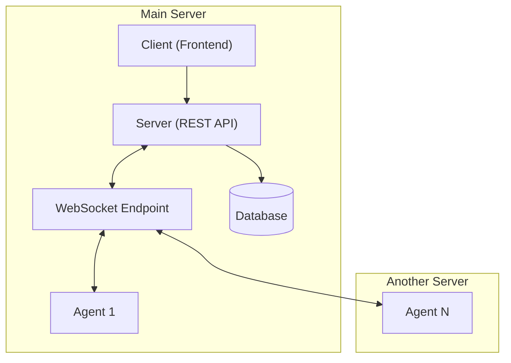
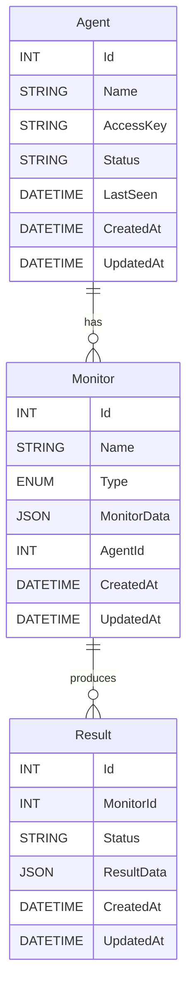

# Stati
An easy-to-use agent based status monitor. Several agents can be used, hence the project name.

## Architecture

```mermaid
flowchart TB
    subgraph SingleServer["Main Server"]
        Client["Client (Frontend)"]
        RestAPI["Server (REST API)"]
        WebSocket["WebSocket Endpoint"]
        Agent1["Agent 1"]
        Database[(Database)]
    end
    subgraph AgentNServer["Another Server"]
        AgentN["Agent N"]
    end

    Client --> RestAPI
    RestAPI --> Database
    RestAPI <--> WebSocket
    WebSocket <--> Agent1
    WebSocket <--> AgentN
```

## Data Structure

```mermaid
erDiagram
    Agent {
        INT Id
        STRING Name
        STRING AccessKey
        STRING Status
        DATETIME LastSeen
        DATETIME CreatedAt
        DATETIME UpdatedAt
    }
    Monitor {
        INT Id
        STRING Name
        ENUM Type
        JSON MonitorData
        INT AgentId
        DATETIME CreatedAt
        DATETIME UpdatedAt
    }
    Result {
        INT Id
        INT MonitorId
        STRING Status
        JSON ResultData
        DATETIME CreatedAt
        DATETIME UpdatedAt
    }

    Agent ||--o{ Monitor : has
    Monitor ||--o{ Result : produces
```
